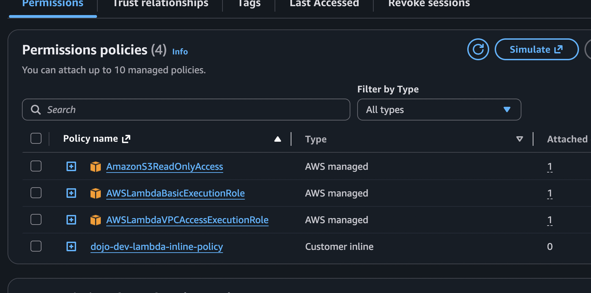

# Configuring the IAM Execution Role

Before testing the Lambda function, the execution role must have sufficient permissions to access AWS services.

Remember that AWS Lambda does not automatically have permission to access S3, Secrets Manager, CloudWatch Logs or resources inside a VPC.

Everything is controlled through IAM Roles.

During our implementation, we created an IAM Role specifically for this Lambda function.

Navigate to

```
AWS Console

↓

IAM

↓

Roles

↓

<Lambda Execution Role>
```

The following managed policies were attached.

```
AWSLambdaBasicExecutionRole
```

Purpose

This policy allows Lambda to write execution logs into CloudWatch.

Without this permission,

you will not see any logs after Lambda execution, making debugging almost impossible.

---

Next policy

```
AWSLambdaVPCAccessExecutionRole
```

Purpose

Since our PostgreSQL database is deployed inside private subnets,

Lambda must also execute inside the same VPC.

This policy allows Lambda to create and manage Elastic Network Interfaces (ENIs) inside the VPC.

Without this permission,

Lambda cannot communicate with resources inside private subnets.

Typical error

```
Task timed out

or

Unable to connect to database
```

---

Next policy

```
AmazonS3ReadOnlyAccess
```

Purpose

Allows Lambda to

- Read uploaded CSV
- Download objects
- Read bucket metadata

Without this permission,

Lambda cannot retrieve uploaded files.

Typical error

```
Access Denied

s3:GetObject
```

---

Additional Inline Policy

Apart from managed policies,

an inline policy was added.

Purpose

To allow Lambda to retrieve database credentials from AWS Secrets Manager.

Permission

```
secretsmanager:GetSecretValue
```

Resource

```
dojo-dev-rds-secrets
```

Without this permission,

Lambda will fail while retrieving the database connection string.

Typical error

```
AccessDeniedException

User is not authorized to perform

secretsmanager:GetSecretValue
```

---

```json
{
	"Version": "2012-10-17",
	"Statement": [
		{
			"Sid": "S3Access",
			"Effect": "Allow",
			"Action": [
				"s3:GetObject",
				"s3:PutObject",
				"s3:DeleteObject",
				"s3:ListBucket"
			],
			"Resource": [
				"arn:aws:s3:::devopsdojo-transaction-files-dev",
				"arn:aws:s3:::devopsdojo-transaction-files-dev/*"
			]
		},
		{
			"Sid": "SecretsManagerAccess",
			"Effect": "Allow",
			"Action": [
				"secretsmanager:GetSecretValue"
			],
			"Resource": "*"
		}
	]
}
```
---



---

# Why We Didn't Give AdministratorAccess

One common mistake is assigning

```
AdministratorAccess
```

to Lambda.

Although this works,

it is not considered secure.

Instead,

we followed the Principle of Least Privilege.

Lambda receives only the permissions required to perform its job.

Advantages

- Better Security
- Reduced attack surface
- Easier auditing
- Production Best Practice

This is a very common interview question.

Interview Answer

"We follow the Principle of Least Privilege by granting only the permissions required for Lambda to perform its intended operations."

---

# Configuring the VPC

This is one of the most important configurations in the entire project.

Initially,

our PostgreSQL database was deployed inside private subnets.

Private subnets cannot be accessed directly from the internet.

Since Lambda needs to communicate with PostgreSQL,

it must also execute inside the same VPC.

Without VPC configuration,

Lambda will never be able to establish a database connection.

The execution flow becomes

```
Lambda

↓

Private VPC

↓

Private Subnet

↓

Amazon RDS PostgreSQL
```

---

Navigate to

```
Lambda

↓

dojo-dev-upload-processor

↓

Configuration

↓

VPC
```

Click

```
Edit
```

Select

```
Project VPC
```

Select the same private subnets where the database resides.

Do NOT choose public subnets.

Reason

Our database is deployed inside private networking.

Keeping Lambda inside the same private network improves security and reduces unnecessary internet exposure.

---

# Security Groups

After selecting the VPC,

configure the Security Group.

A dedicated Security Group was created for Lambda.

Purpose

Allow Lambda to communicate with PostgreSQL.

This Security Group was attached to Lambda.

The RDS Security Group was then updated to allow

```
TCP

Port 5432

Source

Lambda Security Group
```

Notice

The inbound rule references the Security Group itself,

not an IP Address.

Advantages

- Dynamic
- Secure
- No dependency on IP changes
- Recommended AWS Practice

---

# Configure Environment Variables

Navigate to

```
Lambda

↓

Configuration

↓

Environment Variables

↓

Edit
```

Initially,

we considered adding

```
DB_HOST

DB_PORT

DB_USER

DB_PASSWORD

DB_NAME
```

Instead,

we simplified the configuration.

Environment Variables

```
SECRET_NAME=dojo-dev-rds-secrets

BUCKET_NAME=devopsdojo-transaction-files-dev
```

Only two variables are required.

---

Purpose of SECRET_NAME

This tells Lambda

which secret to retrieve from AWS Secrets Manager.

Lambda never stores the database password.

Instead,

during execution,

Lambda performs

```
Read SECRET_NAME

↓

Call Secrets Manager

↓

Retrieve Connection String

↓

Connect PostgreSQL
```

---

Purpose of BUCKET_NAME

Avoids hardcoding bucket names inside Python code.

Advantages

- Easier migration
- Easier deployment across environments
- Better maintainability

If another environment

(dev, test, prod)

uses different bucket names,

only the environment variable changes.

The application code remains unchanged.

---

# Configure the S3 Trigger

Now the Lambda is ready.

The only missing component is automatic invocation.

Instead of manually running Lambda,

Amazon S3 automatically invokes Lambda whenever a file is uploaded.

Navigate

```
Lambda

↓

dojo-dev-upload-processor

↓

Add Trigger
```

Choose

```
S3
```

Bucket

```
devopsdojo-transaction-files-dev
```

Event Type

```
All Object Create Events
```

Prefix

```
inbound/
```

Leave

Suffix

empty.

Click

```
Add
```

---

# What Happens Internally?

Many people think we must manually configure

```
S3

↓

Properties

↓

Event Notifications
```

Actually,

when we added the trigger from the Lambda console,

AWS automatically created the Event Notification.

Later,

we verified this by navigating to

```
Amazon S3

↓

devopsdojo-transaction-files-dev

↓

Properties

↓

Event Notifications
```

An automatically generated Event Notification was present.

Destination

```
dojo-dev-upload-processor
```

Prefix

```
inbound/
```

Event

```
Object Created
```

This confirms that Lambda and S3 are now integrated.

---

# First End-to-End Test

At this point,

everything was configured.

The first validation was performed.

Upload

```
docker_questions.csv
```

to

```
devopsdojo-transaction-files-dev

↓

inbound
```

Immediately after upload,

S3 generated an event.

The event automatically invoked Lambda.

No manual execution was required.

This confirms that the Event Notification is functioning correctly.

---

# Verify CloudWatch Logs

Navigate

```
CloudWatch

↓

Log Groups

↓

/aws/lambda/dojo-dev-upload-processor
```

Open the latest Log Stream.

The logs confirmed

- Lambda started successfully.
- File downloaded successfully.
- CSV parsed successfully.
- PostgreSQL connection established.
- Transaction inserted.
- Lambda execution completed successfully.

No errors were present.

Execution completed successfully in approximately

```
386 ms
```

This confirms

- Layer working
- Secrets Manager working
- PostgreSQL connectivity working
- IAM permissions working
- VPC configuration working
- Lambda Handler working

The complete pipeline was successfully validated.

---

# Verify Database

Finally,

connect to PostgreSQL.

Run

```sql
SELECT *
FROM upload_transactions
ORDER BY id DESC;
```

The latest record confirmed

Status

```
SUCCESS
```

File Name

```
docker_questions.csv
```

Bucket Name

```
devopsdojo-transaction-files-dev
```

Object Key

```
inbound/docker_questions.csv
```

Total Records

```
51
```

Transaction ID

```
1
```

This verified that the entire serverless pipeline was functioning correctly from S3 upload through database insertion.