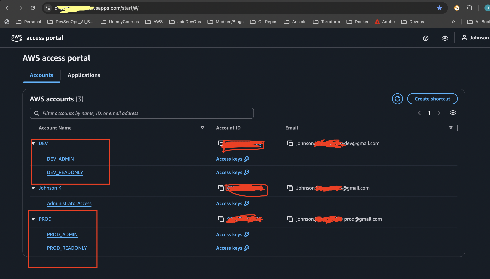
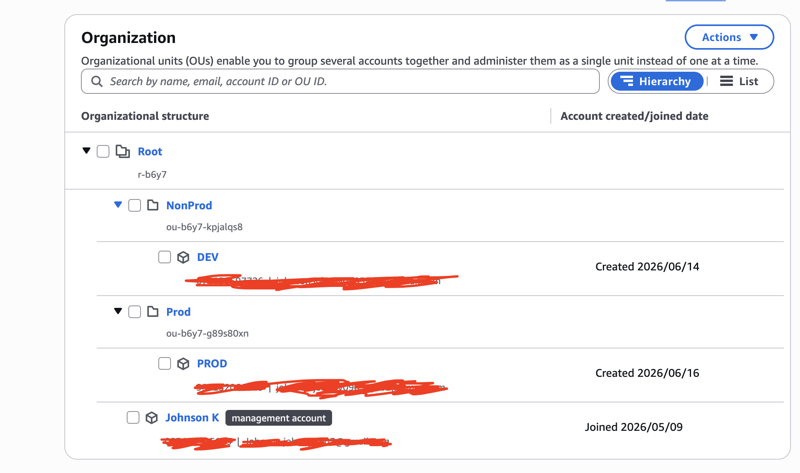

# AWS Organizations and IAM Identity Center - Learning Guide

## Objective

The goal of this exercise is to build an enterprise-style AWS account structure using:

* AWS Organizations
* IAM Identity Center (AWS SSO)
* Multiple AWS Accounts
* Permission Sets
* Read Only and Admin Roles
* Organizational Units (OUs)

This setup closely resembles how many enterprise companies organize and manage their AWS environments.

---

# Final Architecture

```text
AWS Organization
│
├── Management Account (Johnson K)
│   └── AdministratorAccess
│
├── NonProd OU
│   └── DEV Account
│       ├── DEV_ADMIN
│       └── DEV_READONLY
│
└── Prod OU
    └── PROD Account
        ├── PROD_ADMIN
        └── PROD_READONLY
```



---

# Key Concepts

## AWS Account

An AWS Account is an isolated environment where AWS resources are deployed.

Examples:

```text
DEV
PROD
```

Each account has its own:

* Resources
* Permissions
* Infrastructure
* Billing visibility

---

## Management Account

The first account in an AWS Organization.

Responsibilities:

* Manage AWS Organizations
* Create AWS Accounts
* Manage IAM Identity Center
* Create Permission Sets
* Assign Users and Roles

In this setup:

```text
Management Account
=
Johnson K
```

---

## IAM Identity Center (AWS SSO)

IAM Identity Center provides centralized authentication.

Instead of creating separate IAM users inside every AWS account, users are managed centrally.

Example:

```text
Johnson0309
```

---

## IAM Identity Center User

An IAM Identity Center user is NOT an AWS Account.

Example:

```text
Johnson0309
```

This user is granted access to one or more AWS accounts.

Example:

```text
Johnson0309
│
├── Management Account
├── DEV
└── PROD
```

When logging in through AWS SSO, the user only sees the accounts assigned to them.

---

## Permission Sets

Permission Sets define what actions a user can perform inside an AWS account.

Examples:

```text
DEV_ADMIN
DEV_READONLY

PROD_ADMIN
PROD_READONLY
```

Permission Sets are assigned to users through IAM Identity Center.

---

## Organizational Unit (OU)

An Organizational Unit (OU) is a logical folder used to group AWS accounts.

Example:

```text
NonProd OU
└── DEV

Prod OU
└── PROD
```

OUs help organize accounts and simplify governance.



---

# Why Use Organizational Units?

Without OUs:

```text
Root
├── DEV
└── PROD
```

With OUs:

```text
Root
├── NonProd
│   └── DEV
│
└── Prod
    └── PROD
```

Benefits:

* Better organization
* Easier account management
* Foundation for Service Control Policies (SCPs)
* Enterprise-ready structure

---

# Permission Sets Created

## DEV_ADMIN

Purpose:

```text
Full administrative access inside DEV account
```

Capabilities:

* Create resources
* Update resources
* Delete resources
* Manage infrastructure

---

## DEV_READONLY

Purpose:

```text
View infrastructure without making changes
```

Capabilities:

* View ECS
* View CloudWatch
* View RDS
* View VPC
* View ALB
* View Route53
* View Security Groups
* View ECR
* View S3
* View IAM

Cannot:

* Create resources
* Modify resources
* Delete resources

---

## PROD_ADMIN

Purpose:

```text
Full administrative access inside PROD account
```

Capabilities:

* Create resources
* Update resources
* Delete resources
* Manage infrastructure

---

## PROD_READONLY

Purpose:

```text
View production infrastructure without making changes
```

Capabilities:

* View resources
* Read secrets
* Read parameters
* View logs

Cannot:

* Create resources
* Modify resources
* Delete resources

---

# Why Inline Policies Were Required

Initially the read-only roles were created using:

```text
AWS Managed Policy:
ReadOnlyAccess
```

During testing we discovered:

```text
Secrets Manager
→ Secret metadata visible
→ Secret value NOT visible
```

This happened because AWS considers secret values sensitive data.

To allow DevOps engineers to troubleshoot applications while still remaining read-only, additional permissions were required.

---

# What is an Inline Policy?

An inline policy is a custom permission policy attached directly to a Permission Set.

Think of it as:

```text
AWS Managed Policy
+
Custom Permissions
=
Final Permissions
```

Example:

```text
ReadOnlyAccess
+
Secrets Access
+
Parameter Access
=
DEV_READONLY
```

---

# Inline Policy Used

```json
{
  "Version": "2012-10-17",
  "Statement": [
    {
      "Sid": "SecretsManagerRead",
      "Effect": "Allow",
      "Action": [
        "secretsmanager:GetSecretValue",
        "secretsmanager:DescribeSecret",
        "secretsmanager:ListSecrets"
      ],
      "Resource": "*"
    },
    {
      "Sid": "ParameterStoreRead",
      "Effect": "Allow",
      "Action": [
        "ssm:GetParameter",
        "ssm:GetParameters",
        "ssm:GetParametersByPath",
        "ssm:DescribeParameters"
      ],
      "Resource": "*"
    },
    {
      "Sid": "KMSDecryptForSecretsAndParameters",
      "Effect": "Allow",
      "Action": [
        "kms:Decrypt",
        "kms:DescribeKey"
      ],
      "Resource": "*"
    }
  ]
}
```

---

# Why This Policy Was Added

## Secrets Manager

Allows:

```text
Read Secret Values
```

Examples:

* Database passwords
* API keys
* Application credentials

---

## Parameter Store

Allows:

```text
Read Parameter Values
```

Examples:

* Application configuration
* Environment variables
* Database endpoints

---

## KMS

Allows:

```text
Decrypt encrypted secrets and parameters
```

Without KMS permissions, reading secrets may fail even when Secret Manager permissions exist.

---

# Final Read Only Capabilities

The DEV_READONLY and PROD_READONLY roles can:

### Allowed

* View ECS Services
* View ECS Tasks
* View CloudWatch Logs
* View VPC
* View Security Groups
* View Route53
* View ACM Certificates
* View ALB
* View Target Groups
* View RDS
* View ECR
* View S3
* View IAM
* Read Secret Values
* Read Parameter Values

### Not Allowed

* Create Resources
* Modify Resources
* Delete Resources
* Scale Infrastructure
* Modify Secrets
* Modify Parameters

---

# Implementation Steps Performed

## Step 1: Sign In to AWS

Logged in using the AWS root account:

```text
johnson.johnny0903@gmail.com
```

This account later became the AWS Organization Management Account.

---

## Step 2: Create AWS Organization

Navigate to:

```text
AWS Console
→ Search: Organizations
→ AWS Organizations
```

If Organizations is not already enabled:

```text
Create an organization
→ Enable all features
```

Result:

```text
AWS Organization Created
```

The current AWS account automatically becomes the:

```text
Management Account
```

---

## Step 3: Enable IAM Identity Center (AWS SSO)

Navigate to:

```text
AWS Console
→ Search: IAM Identity Center
→ IAM Identity Center
```

Click:

```text
Enable
```

AWS creates:

```text
Identity Center Instance
```

This becomes the centralized location for:

* SSO Users
* Permission Sets
* AWS Account Assignments

---

## Step 4: Create IAM Identity Center User

Navigate to:

```text
IAM Identity Center
→ Users
→ Add User
```

Entered:

```text
Username:
Johnson0309
```

Configured:

```text
Display Name:
Johnson0309
```

Configured sign-in details and completed user creation.

Result:

```text
IAM Identity Center User Created

Johnson0309
```

---

## Step 5: Verify AWS Access Portal

Navigate to:

```text
IAM Identity Center
→ Dashboard
```

Copy the:

```text
AWS Access Portal URL
```

Example:

```text
https://xxxx.awsapps.com/start
```

This URL is used for:

```text
AWS SSO Login
```

---

## Step 6: Assign Management Account Access

Navigate to:

```text
IAM Identity Center
→ AWS Accounts
```

Select:

```text
Management Account
(Johnson K)
```

Click:

```text
Assign Users or Groups
```

Select:

```text
Johnson0309
```

Choose Permission Set:

```text
AdministratorAccess
```

Complete assignment.

Result:

```text
Johnson0309
│
└── Management Account
    └── AdministratorAccess
```

---

## Step 7: Create DEV AWS Account

Navigate to:

```text
AWS Organizations
→ AWS Accounts
→ Add AWS Account
```

Select:

```text
Create an AWS Account
```

Provide:

```text
Account Name:
DEV
```

Provide email:

```text
johnson.johnny0903+dev@gmail.com
```

Click:

```text
Create AWS Account
```

Wait for account status:

```text
Active
```

Result:

```text
DEV Account Created
```

---

## Step 8: Create DEV_ADMIN Permission Set

Navigate to:

```text
IAM Identity Center
→ Permission Sets
→ Create Permission Set
```

Select:

```text
Predefined Permission Set
```

Choose:

```text
AdministratorAccess
```

Set Name:

```text
DEV_ADMIN
```

Create permission set.

Result:

```text
DEV_ADMIN
```

---

## Step 9: Create DEV_READONLY Permission Set

Navigate to:

```text
IAM Identity Center
→ Permission Sets
→ Create Permission Set
```

Select:

```text
Predefined Permission Set
```

Choose:

```text
ReadOnlyAccess
```

Set Name:

```text
DEV_READONLY
```

Create permission set.

Result:

```text
DEV_READONLY
```

---

## Step 10: Assign DEV Roles to SSO User

Navigate to:

```text
IAM Identity Center
→ AWS Accounts
→ DEV
```

Click:

```text
Assign Users or Groups
```

Select:

```text
Johnson0309
```

Assign:

```text
DEV_ADMIN
```

Repeat the same process and assign:

```text
DEV_READONLY
```

Result:

```text
DEV
├── DEV_ADMIN
└── DEV_READONLY
```

---

## Step 11: Create PROD AWS Account

Navigate to:

```text
AWS Organizations
→ AWS Accounts
→ Add AWS Account
```

Provide:

```text
Account Name:
PROD
```

Provide email:

```text
johnson.johnny0903+prod@gmail.com
```

Click:

```text
Create AWS Account
```

Wait until account becomes:

```text
Active
```

Result:

```text
PROD Account Created
```

---

## Step 12: Create PROD_ADMIN Permission Set

Navigate to:

```text
IAM Identity Center
→ Permission Sets
→ Create Permission Set
```

Choose:

```text
AdministratorAccess
```

Set Name:

```text
PROD_ADMIN
```

Create permission set.

---

## Step 13: Create PROD_READONLY Permission Set

Navigate to:

```text
IAM Identity Center
→ Permission Sets
→ Create Permission Set
```

Choose:

```text
ReadOnlyAccess
```

Set Name:

```text
PROD_READONLY
```

Create permission set.

---

## Step 14: Assign PROD Roles to SSO User

Navigate to:

```text
IAM Identity Center
→ AWS Accounts
→ PROD
```

Assign:

```text
PROD_ADMIN
```

and

```text
PROD_READONLY
```

to:

```text
Johnson0309
```

Result:

```text
PROD
├── PROD_ADMIN
└── PROD_READONLY
```

---

## Step 15: Add Inline Policy to Read Only Roles

Navigate to:

```text
IAM Identity Center
→ Permission Sets
→ DEV_READONLY
```

Open:

```text
Permissions
→ Add Inline Policy
```

Paste the custom JSON policy.

Save changes.

Repeat the same process for:

```text
PROD_READONLY
```

After saving:

```text
Provision Permission Set
```

to the target account.

Purpose:

* Read Secrets Manager values
* Read SSM Parameter values
* Allow KMS decryption

while still remaining read-only.

---

## Step 16: Test Read Only Role

Login using:

```text
AWS Access Portal
```

Select:

```text
DEV
→ DEV_READONLY
```

Verify:

```text
Can view resources
Can retrieve secret values
Cannot modify resources
Cannot create resources
```

Result:

```text
DEV_READONLY validated successfully
```

---

## Step 17: Create Organizational Units (OUs)

Navigate to:

```text
AWS Organizations
→ AWS Accounts
```

Select:

```text
Root
```

Click:

```text
Actions
→ Create Organizational Unit
```

Create:

```text
NonProd
```

Repeat and create:

```text
Prod
```

Result:

```text
Root
├── NonProd
└── Prod
```

---

## Step 18: Move DEV Account to NonProd OU

Navigate to:

```text
AWS Organizations
→ AWS Accounts
```

Select:

```text
DEV
```

Click:

```text
Actions
→ Move
```

Destination:

```text
NonProd
```

Result:

```text
NonProd
└── DEV
```

---

## Step 19: Move PROD Account to Prod OU

Navigate to:

```text
AWS Organizations
→ AWS Accounts
```

Select:

```text
PROD
```

Click:

```text
Actions
→ Move
```

Destination:

```text
Prod
```

Result:

```text
Prod
└── PROD
```

---

## Final State

```text
AWS Organization
│
├── Management Account (Johnson K)
│   └── AdministratorAccess
│
├── NonProd OU
│   └── DEV
│       ├── DEV_ADMIN
│       └── DEV_READONLY
│
└── Prod OU
    └── PROD
        ├── PROD_ADMIN
        └── PROD_READONLY
```

AWS Access Portal:

```text
DEV
├── DEV_ADMIN
└── DEV_READONLY

PROD
├── PROD_ADMIN
└── PROD_READONLY

Johnson K
└── AdministratorAccess
```


