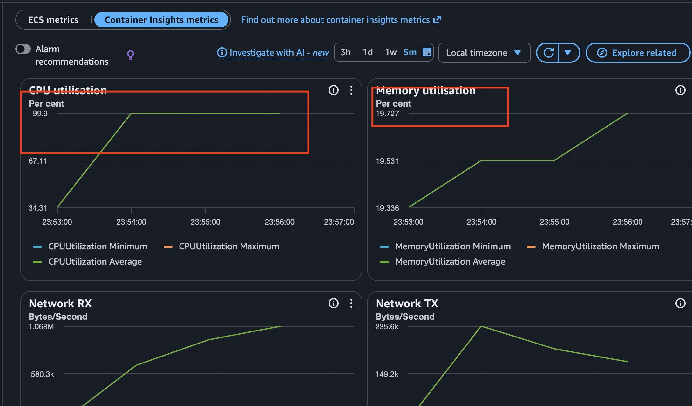
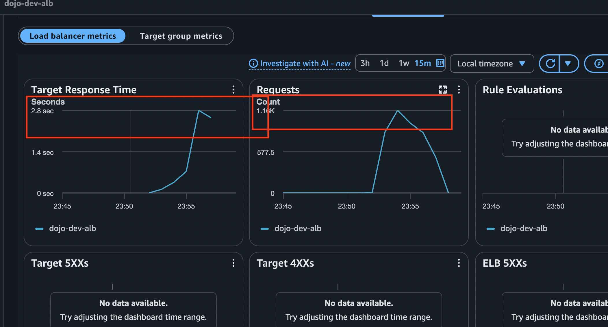
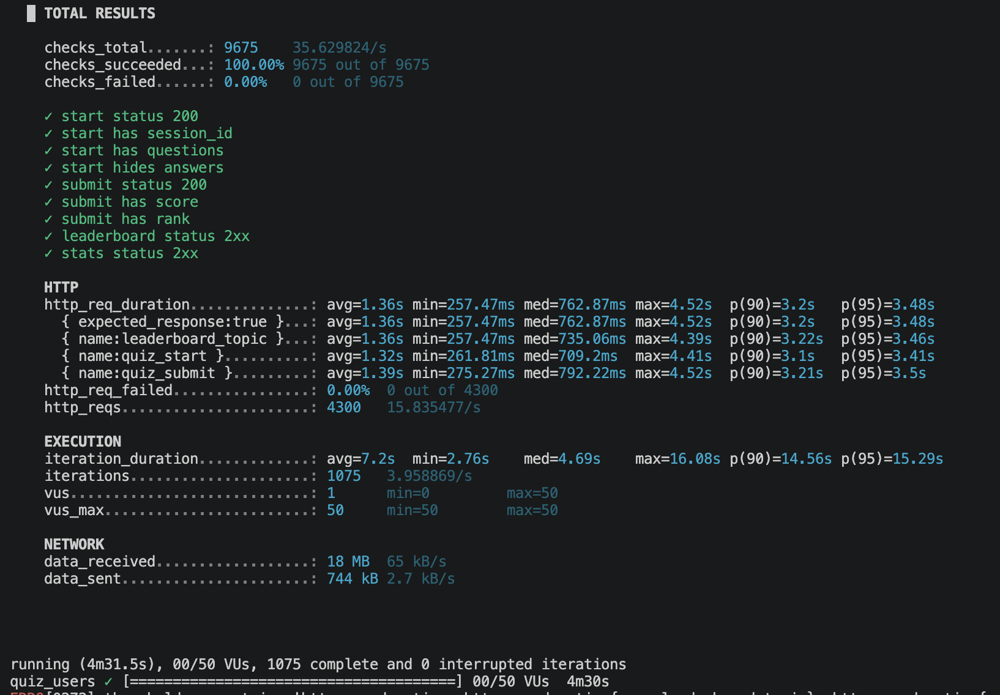
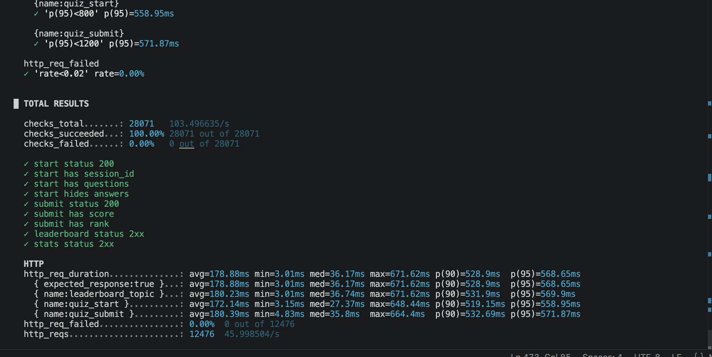
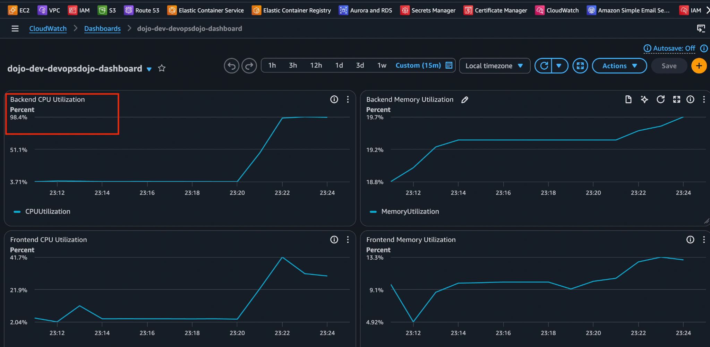
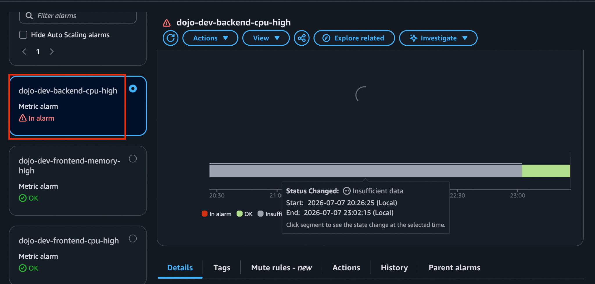
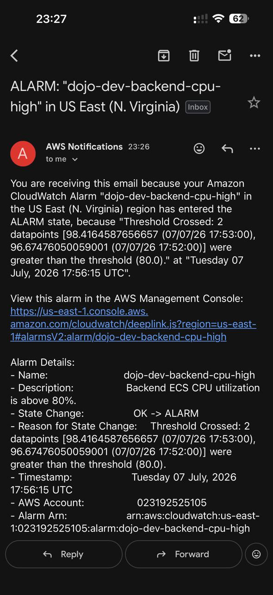

---

## CloudWatch Dashboard Layout

```text
CloudWatch Dashboard
│
├── Infrastructure Monitoring
│   ├── ECS
│   │   ├── Backend CPU Utilization
│   │   ├── Backend Memory Utilization
│   │   ├── Frontend CPU Utilization
│   │   └── Frontend Memory Utilization
│   │
│   └── Application Load Balancer (ALB)
│       ├── Request Count
│       ├── Target Response Time
│       ├── Target 4XX Errors
│       ├── Target 5XX Errors
│       ├── Healthy Host Count
│       └── UnHealthy Host Count
│
├── Application Monitoring (EMF)
│   ├── Backend Request Duration Overall
│   ├── API Request Duration
│   └── HTTP Request Count
│
└── Application Monitoring (Log Metric Filters)
    ├── Backend 5XX Errors
    ├── Backend ERROR Logs
    └── Frontend Proxy Errors
```

---

# Performance Testing Guide (k6 + AWS ECS)

## Objective

Validate the performance of the application deployed on AWS ECS using **k6**, observe infrastructure metrics using **CloudWatch Container Insights**, and identify application bottlenecks before enabling Auto Scaling.

---

# Architecture

```
k6
 │
 ▼
Route53
 │
 ▼
Application Load Balancer (ALB)
 │
 ▼
ECS Service (1 Task)
 │
 ▼
Backend Container
 │
 ▼
RDS Database
```

---

# Monitoring Setup

Before running any performance test, open the following AWS Console pages:

### 1. ECS Service

```
ECS
→ Cluster
→ Backend Service
→ Health and Metrics
```

Monitor:

- CPU Utilization
- Memory Utilization
- Running Tasks

---

### 2. ALB Monitoring

```
EC2
→ Load Balancer
→ Monitoring
```

Monitor:

- Request Count
- Target Response Time
- Target 5XX Errors

---

### 3. CloudWatch Logs

```
CloudWatch
→ Log Groups
→ /ecs/backend
```

Monitor:

- Exceptions
- Stack Traces
- Database Errors
- HTTP 500 Errors

---

# Why Container Insights?

Enabled in the ECS Cluster:

```terraform
setting {
  name  = "containerInsights"
  value = "enabled"
}
```

AWS automatically creates the required CloudWatch Container Insights log groups and publishes:

- CPU
- Memory
- Network RX/TX
- Task Metrics

No additional Terraform resources are required.

---

# Smoke Test

Run:

```bash
./run-live.sh smoke
```

Purpose:

- Verify application health
- Validate complete quiz journey
- Ensure APIs are working
- Verify thresholds

Smoke Test Results:

- 10 VUs
- 10 Shared Iterations
- 110/110 Checks Passed
- HTTP Failures = 0%
- P95 Response Time = 428 ms

Result:

✅ Application Healthy

---

# Load Test

Run:

```bash
./run-live.sh load
```

Scenario:

- Ramp to 20 Users
- Hold
- Ramp to 50 Users
- Hold
- Ramp Down

Thresholds:

- HTTP Failure < 2%
- Overall P95 < 1.5 s
- Quiz Start P95 < 800 ms
- Quiz Submit P95 < 1.2 s
- Leaderboard P95 < 600 ms

---

# Load Test Results

Execution Summary:

- 50 Max VUs
- 4300 HTTP Requests
- 1075 Quiz Iterations
- HTTP Failures = 0%
- Checks Passed = 9675 / 9675

Performance:

- Average Response = 1.36 s
- P95 Response = 3.48 s
- Maximum Response = 4.52 s

Threshold Result:

❌ Response Time Thresholds Failed

---

# AWS Observations

## ECS

CPU:

- Increased from ~3% to ~100%
- Remained saturated during peak load

Memory:

- Stable around 19%
- No significant increase

Conclusion:

**CPU became the bottleneck.**

---

## ALB

Request Count:

- Increased significantly during load

Target Response Time:

- Increased from ~105 ms
- Reached ~2.8 seconds

Target 5XX:

- No Errors

Conclusion:

Application remained available but responded more slowly under load.

---

# Bottleneck Analysis

Observed:

- CPU = ~100%
- Memory = ~19%
- HTTP Failures = 0%
- No 5XX Errors

Conclusion:

The backend ECS task became **CPU-bound**, not memory-bound.

The application stayed functional but response times increased because the single ECS task had exhausted its available CPU.

---

# Key Learnings

- Always verify the application manually before executing performance tests.
- Run a smoke test before a load test.
- Keep ECS Metrics, ALB Metrics, and CloudWatch Logs open while testing.
- High CPU does not necessarily mean application failure.
- Response time increases when CPU becomes saturated.
- Memory usage should be analyzed independently from CPU.
- CloudWatch metrics have a slight delay; refresh periodically during testing.

---

# Future Improvements

- Increase ECS CPU allocation (256 → 512 or higher)
- Enable ECS Service Auto Scaling
- Compare performance before and after scaling
- Tune application code if CPU remains the bottleneck
- Create CloudWatch Dashboards and Alarms for production monitoring

---

# Backend vs Frontend Load Test Comparison

| Metric | Backend Load Test | Frontend Load Test | Observation |
|---------|------------------:|-------------------:|-------------|
| Test Duration | ~4.5 minutes | 2 minutes | Backend test simulated a heavier workload |
| Max Virtual Users (VUs) | 50 | 20 | Backend received higher concurrent traffic |
| HTTP Requests | 4300 | 3216 | Backend processed more requests |
| Quiz Iterations | 1075 | 1072 | Similar number of user journeys |
| HTTP Failures | 0% | 0% | No request failures in either test |
| Checks Passed | 9675 / 9675 | 3216 / 3216 | All validations passed |
| Average Response Time | **1.36 s** | **412 ms** | Frontend responded significantly faster |
| P95 Response Time | **3.48 s** ❌ | **785 ms** ✅ | Backend exceeded threshold, frontend remained within SLA |
| Maximum Response Time | 4.52 s | 2.09 s | Backend experienced much higher latency |
| ECS CPU Utilization | ~100% | ~39% | Backend became CPU-bound, frontend remained healthy |
| ECS Memory Utilization | ~19% | ~14% | Memory was not a bottleneck for either service |
| ALB Target Response Time | ~2.8 s | ~175 ms | Backend latency was reflected at the ALB |
| ALB 5XX Errors | 0 | 0 | No server-side failures |
| CloudWatch Exceptions | None | None | Application remained stable throughout testing |

---

# Analysis

### Backend Service

- CPU utilization reached nearly **100%**.
- Memory utilization remained almost constant (~19%).
- Response times increased significantly under load.
- No HTTP failures or 5XX errors occurred.
- **Conclusion:** Backend became **CPU-bound**. The application stayed stable but responded more slowly due to CPU saturation.

---

### Frontend Service

- CPU utilization peaked at approximately **39%**.
- Memory utilization remained low (~14%).
- Response times stayed well below the configured threshold.
- No HTTP failures or 5XX errors occurred.
- **Conclusion:** Frontend handled the workload comfortably and did not become a bottleneck.

---

## CloudWatch Monitoring Validation

After deploying the infrastructure and application, the complete monitoring stack was validated using k6 load testing.

### Infrastructure Monitoring

The following monitoring components were provisioned using Terraform:

- CloudWatch Dashboard
- CloudWatch Alarms
- Amazon SNS Topic
- Email Subscription

The dashboard includes:

- Backend CPU Utilization
- Backend Memory Utilization
- Frontend CPU Utilization
- Frontend Memory Utilization
- ALB Request Count
- ALB Target Response Time
- ALB Target 4XX Errors
- ALB Target 5XX Errors
- Healthy Host Count
- UnHealthy Host Count

CloudWatch Alarms were configured for:

- Backend CPU (>80%)
- Backend Memory (>80%)
- Frontend CPU (>80%)
- Frontend Memory (>80%)
- ALB Target Response Time (>3 seconds)
- ALB Target 4XX Errors
- ALB Target 5XX Errors
- UnHealthy Host Count

Amazon SNS was integrated with CloudWatch Alarms to send email notifications whenever an alarm entered the **ALARM** state and again when it returned to the **OK** state.

---

## Monitoring Validation

After deployment:

- Verified the CloudWatch Dashboard was displaying live ECS and ALB metrics.
- Verified all CloudWatch Alarms were initially in the **OK** state.
- Verified the SNS Email Subscription was successfully confirmed.
- Executed backend and frontend k6 load tests.
- Observed live CPU, Memory, Request Count and Response Time changes on the dashboard.
- Backend CPU utilization exceeded the configured threshold (>80%), causing the CloudWatch Alarm to transition from **OK → ALARM**.
- Successfully received an SNS email notification for the alarm.
- After the load test completed and CPU utilization returned to normal, the alarm transitioned from **ALARM → OK**, and a recovery email was successfully received.

This validated the complete monitoring pipeline end-to-end.

```text
Application
      │
      ▼
CloudWatch Metrics
      │
      ▼
CloudWatch Dashboard
      │
      ▼
CloudWatch Alarm
      │
      ▼
Amazon SNS
      │
      ▼
Email Notification
```

---

## Application Monitoring

Application monitoring extends infrastructure monitoring by collecting application-specific metrics that AWS does not provide by default.

### Embedded Metric Format (EMF)

The application is already instrumented to publish custom metrics using **Embedded Metric Format (EMF)**.

Current EMF Metrics include:

- RequestDurationOverall
- RequestDuration
- HttpRequestCount

These metrics are automatically created as CloudWatch Custom Metrics without requiring Log Metric Filters.

EMF is primarily used to monitor:

- Request Latency
- API Performance
- Request Throughput
- Business/Application Metrics

Flow:

```text
Application
      │
      ▼
EMF Logs
      │
      ▼
CloudWatch Custom Metrics
```

---

### Log Metric Filters

The application also generates structured JSON logs.

CloudWatch Log Metric Filters convert matching log patterns into CloudWatch Custom Metrics.

Examples include:

- Backend5xxCount
- BackendErrorCount
- FrontendProxyErrorCount

These metrics can then be used to build Dashboards and CloudWatch Alarms.

Flow:

```text
Application Logs
        │
        ▼
CloudWatch Log Metric Filter
        │
        ▼
CloudWatch Custom Metric
```

Unlike EMF, Log Metric Filters must be explicitly created in Terraform.

---

---

## Understanding EMF Metrics and Dimensions

### Metric vs Dimension

A **Metric** represents **what is being measured**, while a **Dimension** identifies **which resource or category the metric belongs to**.

Examples:

| Metric | Dimension |
|--------|-----------|
| CPUUtilization | ClusterName, ServiceName |
| MemoryUtilization | ClusterName, ServiceName |
| RequestDuration | Endpoint, Method, StatusClass |
| HttpRequestCount | Endpoint, Method, StatusClass |
| RequestDurationOverall | Service |

---

### Example

Suppose a user sends:

```text
POST /leaderboard
```

The backend returns:

```text
HTTP 500
```

and the request completes in **850 ms**.

CloudWatch EMF publishes:

**Metric**

```text
RequestDuration = 850 ms
```

**Dimensions**

```text
Endpoint    = leaderboard
Method      = POST
StatusClass = 5xx
```

CloudWatch stores the metric together with these dimensions, allowing you to filter and analyze latency for a specific API, HTTP method, and response status.

---

### EMF Metrics Used in This Project

**RequestDurationOverall**

- Overall average response time of the backend service.
- Dimension: `Service = backend`

**RequestDuration**

- Average response time for a specific API.
- Dimensions:
  - Endpoint
  - Method
  - StatusClass

**HttpRequestCount**

- Number of requests received by a specific API.
- Dimensions:
  - Endpoint
  - Method
  - StatusClass

---

### Key Takeaway

Think of it as:

- **Metric → What is being measured?**
- **Dimension → Which resource or request does the metric belong to?**

This allows CloudWatch to drill down from overall service health to individual API performance, making it easier to identify the exact endpoint, HTTP method, or status code causing an issue.

---

## Key Learning

Infrastructure Monitoring and Application Monitoring complement each other.

- **Infrastructure Monitoring** answers: *Is the AWS infrastructure healthy?* (CPU, Memory, ALB, ECS)

- **Application Monitoring** answers: *Is the application healthy?* (Latency, Request Count, 5XX Errors, Proxy Errors, Business Metrics)

Together they provide a complete production-grade monitoring solution for deployments, performance testing, troubleshooting and incident response.

---

# Overall Conclusion

The performance bottleneck is **not the Application Load Balancer or the Frontend ECS Service**.

The **Backend ECS Service** is the primary bottleneck because it exhausted its available CPU resources while memory remained stable.

This indicates that the next optimization should focus on the backend by:

- Increasing ECS task CPU allocation.
- Enabling ECS Service Auto Scaling.
- Optimizing CPU-intensive application logic if required.

The frontend has sufficient capacity and does not require optimization at the current workload.

