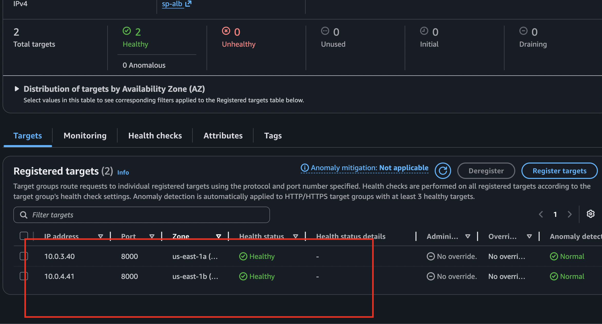
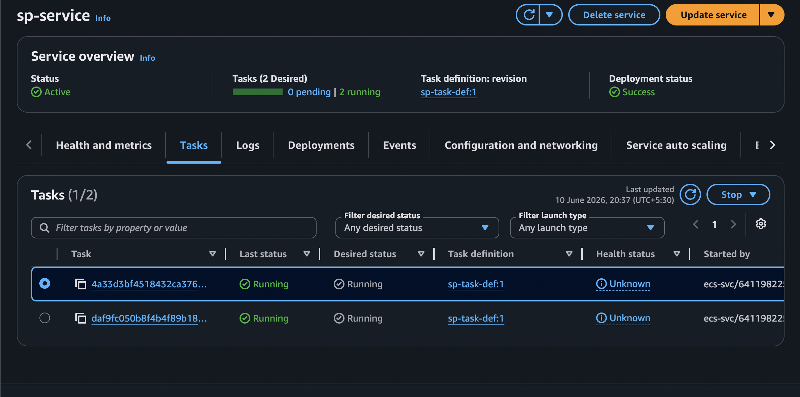
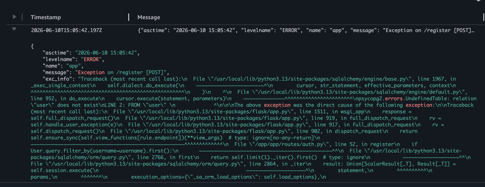

```hcl
# On Terraform apply got these errors

╷
│ Error: creating IAM Role (ecsTaskExecutionRole): operation error IAM: CreateRole, https response error StatusCode: 409, RequestID: e21b423d-8264-49f6-a6f7-08f0598ec694, EntityAlreadyExists: Role with name ecsTaskExecutionRole already exists.
│ 
│   with aws_iam_role.ecs_task_execution_role,
│   on iam.tf line 2, in resource "aws_iam_role" "ecs_task_execution_role":
│    2: resource "aws_iam_role" "ecs_task_execution_role" {
│ 
╵
╷
│ Error: creating RDS DB Instance (sp-rds-instance): operation error RDS: CreateDBInstance, https response error StatusCode: 400, RequestID: 5eb4629e-68cf-45e6-88ef-983b130f8684, api error InvalidParameterValue: DBName must begin with a letter and contain only alphanumeric characters.
│ 
│   with aws_db_instance.sp_rds_instance,
│   on rds.tf line 20, in resource "aws_db_instance" "sp_rds_instance":
│   20: resource "aws_db_instance" "sp_rds_instance" {
│ 
```

# RCA:
* Fixed above issues by deleting existing role that created manually
* updated db name with no hypens, underscores and spaces

---

# Issue 2 
```hcl
╷
│ Error: creating ECS Task Definition (sp-task-def): operation error ECS: RegisterTaskDefinition, https response error StatusCode: 400, RequestID: 50eac92a-a863-4bc1-80cd-21f7cb05c6e9, ClientException: No Fargate configuration exists for given values: 1024 CPU, 1024 memory. See the Amazon ECS documentation for the valid values.
│ 
│   with aws_ecs_task_definition.sp_task_definition,
│   on ecs.tf line 12, in resource "aws_ecs_task_definition" "sp_task_definition":
│   12: resource "aws_ecs_task_definition" "sp_task_definition" {
│ 
╵
```

* Fixed by updating memory size to 2048. Reason for 1 cpu 1024, cannot be paired with 1024 memory. valid combinations are as below
```
    cpu = 1024

    memory = 2048
    memory = 3072
    memory = 4096
    memory = 5120
    memory = 6144
    memory = 7168
    memory = 8192
```
----


# Succesfully Deployed an app and below are the snippets attached




----

# Issue 3:
While registering got 500 Internal Server error

## Troubleshooting Steps:
* Check the cloud watch logs 
* Log details


* Error says - DB schema is not created as DB initilaization code is the main block in run.py which dont exceute with gunicorn. Hence updated the code with `db.create_all()` in _init_.py file in `app.app_context()` function block

---


## 1. Missing `requires_compatibilities` in ECS Task Definition

### Error

When creating the ECS task definition for Fargate, the task failed to register or the ECS service could not launch tasks correctly.

### Cause

The task definition was missing:

```hcl
requires_compatibilities = ["FARGATE"]
```

Without this setting, ECS does not know that the task is intended to run on AWS Fargate.

### Fix

Added the following to the task definition:

```hcl
requires_compatibilities = ["FARGATE"]
network_mode             = "awsvpc"
```

After updating the task definition and applying Terraform, the ECS task registered successfully.

---

## 2. ECS Execution Role Missing Secrets Manager Permission

### Error

The ECS task failed to start and was unable to retrieve secrets configured in the task definition. ECS reported resource initialization errors when attempting to fetch secrets from AWS Secrets Manager.

### Cause

The ECS task execution role only had permissions to pull container images from ECR and write logs to CloudWatch. It did not have permission to read the database secret stored in AWS Secrets Manager.

### Fix

Added the following permission to the ECS execution role policy:

```hcl
{
  Effect = "Allow"
  Action = [
    "secretsmanager:GetSecretValue"
  ]
  Resource = aws_secretsmanager_secret.sp_db_secret.arn
}
```

After updating the IAM policy, ECS was able to retrieve the secret and start the container successfully.

---

## 3. ALB Target Group Using Default `instance` Target Type

### Error

The ECS service continuously failed health checks and targets were not registered correctly with the Application Load Balancer.

### Cause

The target group was created using the default target type:

```hcl
target_type = "instance"
```

AWS Fargate tasks do not run on EC2 instances. Each task receives its own Elastic Network Interface (ENI) and IP address.

### Fix

Changed the target group configuration to:

```hcl
target_type = "ip"
```

This allows the Application Load Balancer to register the IP addresses of Fargate tasks directly.

### What `target_type = "ip"` Means

The load balancer routes traffic directly to the private IP addresses of ECS Fargate tasks. This is required for Fargate because there are no EC2 instances available for the load balancer to target.

After updating the target group and redeploying the service, the targets became healthy and traffic was routed successfully.

---


